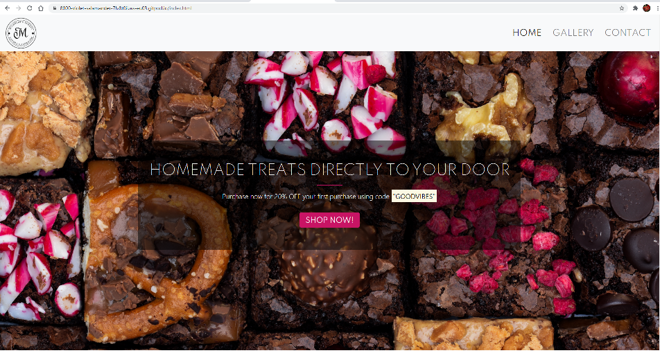
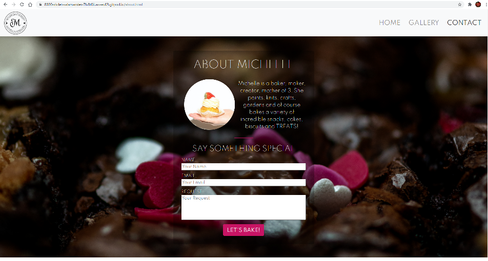
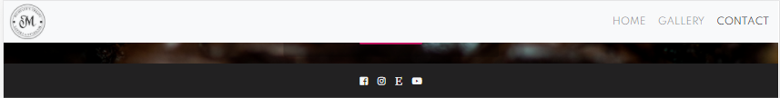
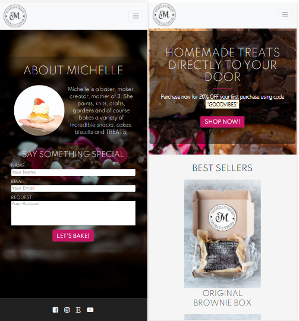
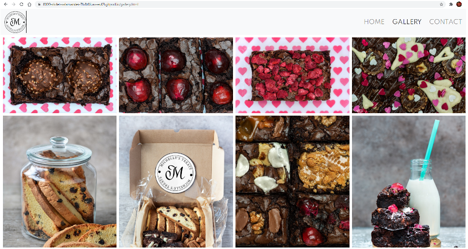
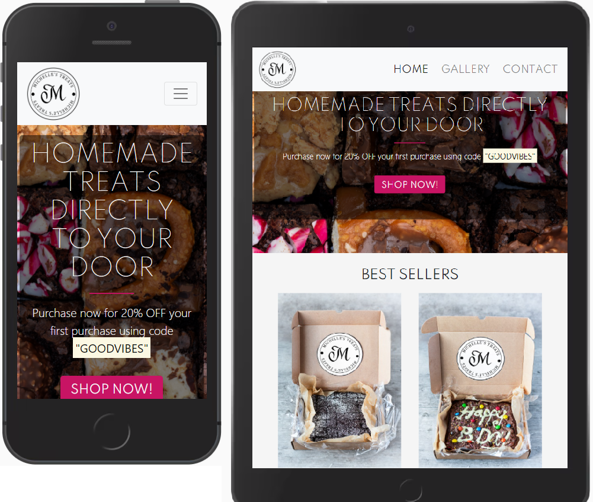

# Michelle's Treats

Michelle is a baker, maker, creator, mother of 3 and the mother of my girlfriend. She paints, knits, crafts, gardens and of course bakes a variety of incredible snacks, cakes, biscuits and TREATS!

This website is a preliminary staging ground for selling her delicuious treats to the wider world. Michelle has already been selling her Treats through etsy and instagram marketing but through creating a website, she will have a base of operation to direct all of her interest to with information on herself, a gallery of all the tasty Treats and a place to request personalised packages.

# UX

## Project Goals

The primary goal of "Michelle's Treats" is to create a welcoming, attractive, *"functional"* website for Michelle to direct all her traffic from other social media sources (Etsy/Instagram/Facebook) to, in order to sell / discuss the selling of her Treats.

## User Stories

As a **Consumer**, visiting this website, interested in purchasing or finding out information on Michelle's Treats, I want:

1. An intuitive website that allows me to navigate easily to the different pages.
2. To be able to contact the seller to receive more information on the variety of products and personalised boxes.
3. To be able to visit the sellers various social media accounts through a consistent footer layout.
4. Consistent layout of header and footer design to familiarise with on each page.
5. Consistent main content layout that has some consisent design or sizes that ensures myself that I am still on the correct website at all times.
6. Engaging, high quality images that entice me into purchasing a product or wanting to find out more.

As the **Business/Website Owner**, using this website as the hub of all social media and the main location of purchases, I want: 

1.  Users to be able to easily navigate my website, finding it welcoming, colourful and reflective of the products I am selling.
2. To be able to naigate users to the contact page where they can get in touch to enquire about my products and eventually purchase them.
3. The images used, both in the background and in the gallery to accurately reflect my products, to increase interest and sales.
4. My website to be multi-functional across varies devices, mobile, tablet and PC so users can browse my website at their convenience, wherever they may be, whatever they may be doing.

## Business Goals

Having been selling on Etsy and through friends of friends and family, and fine-tuning the box sizes and pricing of various treat bundles, Michelle is now ready to expand her business to a full-scale website to bring all of her outlets to one core place. This website will be the hub of all other social media sources, directing all interest hungry buyers to inspect mouth-watering pictures and competitive prices all in one place. This website is designed to eventually have all the variety of treats available as well as mix boxes and personalisable options for special occasions. This website will also give Michelle a much easier time of expanding to other exports such as Birthday Cakes and vegan, gluten free or keto Treats!

## Design Choices

The design for this website was simple. Make it modern and classy enough to attract a younger-more-computer-savvy audience, whilst also being clean and smart to attract those not too hot on the keys. It also needed to be welcoming, as Michelle is, it needed to reflect her. A nice mix of pale colours to contrast well with a Monochromatic header and footer scheme, whilst also matching potential colours of images of the Treats. Sharp angles, straight lines, clean cut, clearly showing the different sections from Header to Landing image to footer. Fonts/Colours TBC.

## Wireframes

The Wireframes were created using [balsamiq](https://balsamiq.com/wireframes/?gclid=Cj0KCQiA4L2BBhCvARIsAO0SBdZKeRLN-dlJkDnWv6KHNSZbivUxu8qMGqb8sbqJm_8n7Sw-QmrXjbEaAtdTEALw_wcB) and within each of them 3 more Wireframes were created for each of the potential user devices, phone, tablet and computer. The first Wireframe is the Landing page (HOME) With a nice large image of a mix box of Treats. It will also contain below it a couple more images of the top Treats that can be purchased from Michelle.

The 2nd Wireframe is the Gallery. A very important page for advertising food and drink, to entice the audience into purchasing. A simple, clean, full page gallery of the different Treats Michelle has to offer.

The 3rd Wireframe is the "About" page. This will contain two pieces of content. It will firstly contain a small blurb about Michlle and her baking career with an image of the Mastermind in the kitchen. Below this there will be a "Get in Touch" section, where those interested can request to Michelle what they would like in their Treat box or what they would like Michelle to construct for them if it has not yet been done. (Unlikely) Here, users will input their Name, Email and "Request", where they have a small box to ask for potential Treat ingredient they would like in their box and for what price/size they are looking for.

All 3 pages will have a consistent Header and Footer section, using the same font styles, sizes and colour schemes. They will have links below to Michelles Etsy store, Instagram page, Facebook page and a fictional Youtube channel, all consistent across each page.

# Features

## Main Features

* Header - Remains consistent throughout the website. Contains links to the HOME, GALLERY and CONTACT pages. Clicking the "Michelle's Treats" text will also direct users to the HOME page.
* Footer - Remains consistent throughout the website. Contains copyright information and links to Michelle's social media. - Facebook, Instagram, Etsy and Youtube. 
* Landing Image - (HOME) Has a message welcoming users to the  website, instantly informing what the website is about and what they can get from it.
* "Menu" - A few images below the landing image showing the "most popular" treats purchased from the website with pricing information.
* Gallery - images of all the treats available from Michelle's Treats - made to entice users into buying!
* About - a brief bit of text just allowing users to get to know Michelle a bit better and feel more connected to the person they are buying from. Makes the experience less robotic.
* Get in Touch - Where users can submit their Name, Email and a request for a specific box of treats using new sweets and Treats for something unique.

# Technologies Used

* HTML 
* CSS
* [Bootstrap](https://getbootstrap.com/)
    - Boostraps pre-made layouts and commands were used to greatly speed up the website creation.
* [Font Awesome](https://fontawesome.com/)
    - FA used to implement all the icons for improving UX and the website design.
* [Code Institute](https://codeinstitute.net/)
    - Many of the code techniques and lines of code from previous websites created were re-used in this project.

# Testing

## Testing the stories from UX section

As a **Consumer**, visiting this website, interested in purchasing or finding out information on Michelle's Treats, I want:

1. An intuitive website that allows me to navigate easily to the different pages.

* I made a simple and intuitive navbar with a logo that always navigates users to the HOME page as well as 3 large headers that lead to their respective pages. For tablet and mobile users there is a large button that expands to show all 3 headers again. I kept the font large as to make the wording clear and fixed the header above the content so that expanding the navbar did not interupt the layout of the page.


2. To be able to contact the seller to receive more information on the variety of products and personalised boxes.

* On the CONTACT page there is a large and distinctive form that all users / buyers can fill out to contact Michelle's Treats to ask for specific treats to be created.


3. To be able to visit the sellers various social media accounts through a consistent footer layout.

* Attached to each page is a consistent footer that links to hypothetical links to Michelle's Treats other social media pages.


4. Consistent layout of header and footer design to familiarise with on each page.

I used a clean and contrasting header and footer layout that is consistent across all 3 pages as well as in tablet and mobile form.


5. Consistent main content layout that has some consisent design or sizes that ensures myself that I am still on the correct website at all times.

The main content layout was harder to keep consistent as I used a gallery page as one of the 3 pages. I kept the photos used consistent however with high quality images used that are all similar that link the pages together. I also used the same jumbotron design on both the HOME and CONTACT pages that link the two together.


6. Engaging, high quality images that entice me into purchasing a product or wanting to find out more.

All images are my own and were taken at around 6000px X 4000px, maintaining a very high quality. There were then shrunk to around 600px X 400px to reduce page loading times.


As the **Business/Website Owner**, using this website as the hub of all social media and the main location of purchases, I want: 

1.  Users to be able to easily navigate my website, finding it welcoming, colourful and reflective of the products I am selling.


A greyscale header, footer and background colour scheme was used consistently across all the pages with bright images and a deeppink accent colour for the buttons and horizontal rules.


2. To be able to naigate users to the contact page where they can get in touch to enquire about my products and eventually purchase them.

The header uses large dark font on the whitesmoke background to easily show users the 3 pages of the website. The CONTACT page, simply labelled, draws any users that wish to get in touch with Michelle's Treats to the last page where they can fill out a form to contact the seller.


3. The images used, both in the background and in the gallery to accurately reflect my products, to increase interest and sales.

All images are high quality, bright and show a large variety of the flavours and ingredients that are used in the brownies.


4. My website to be multi-functional across varies devices, mobile, tablet and PC so users can browse my website at their convenience, wherever they may be, whatever they may be doing.

The website has been build with mobile users primarily in mind, before expanding the website to tablet and desktop users. The header uses a button that expands to reveal the header titles on mobile but disappears on tablet and desktop when the header becomes large enough to accomodate all three headings. The gallery starts of with all images in one scrollable column. It then expands to a two column gallery for tablet users and a 4 column gallery for desktop users. 


### ON THE GO TESTING / PROBLEMS

1. NAVBAR
The first issue I came across was creating the perfect Navbar. For a short while I struggled to get my content to appear on the right side and for the button to disappear when the page was expanded. Therefore... I wanted my Navbar to have my logo in the top left and the headings in the top right, which would then turn into a button that opens into a dropdown menu, also aligned right. I first sourced a navbar element from Bootstrap that had a heading in the top left and the button in the top right as I thought those would be the hardest to create. Then I replaced the heading with an  and aligned the headings to the left with justify and align classes. I then also had to tell the button to only appear when the page size was below a certain size so it only appeared on mobile and tablet pages. I also added the class fixed to my header to make it always stay at the top of the page even when scrolled down.

2. FIXED NAVBAR
In making my navbar fixed to the top of the page it brought my content up to the page height to fill "the gap" the navbar had been covering. I therefore had to give my content/callout a large margin-top to bring it down in line with the point that the header ended. This was not a particularly hard fix, but it was an interesting interaction.

3. MEDIA QUERY
a) When I had completed the first page of the website, the HOME page, I proceeded to test it using "F12 Dev tools" to see how the website looked on mobile. Of course, none of the elements fit as I had not yet assinged media queries. I therefore assinged various media queries for tablet that moved my four images into two rows of two, and then for mobile into four rows of one. I also adjusted the width of my callout to fit within each mobile size at different pixel sizes.
b) I also made sure that even if mobile and tablet users were to view the website with their phone on landscape mode that the callout did not get cut off by the header. I did this by adding a media query that adjusted the callout size from 100vh to around 600px.
c) Another issue I had at small sizes (mobile) was that my content was not centered, even though it had the correct classes and was centered when in desktop and tablet mode. I found out that this was an issue with the page not being large enough to fit the content, so it was slowly shifting it to the right to compensate. I fixed this issue by adding a margin of 5px / 10px /15px to the right side of my content when appropriate to keep it centered.

4. GALLERY 
I wanted a 4 column gallery with 12 images spread evenly. To do this I followed the "Love Running" gallery tutorial. I added my margins and column gaps and it was all great. However, when I went to reduce the gallery to a 2 column page for tablet users, the images were uneven, with 7 images in the first column and 5 in the second. This made ZERO sense to me and most of the internet as I could not find a solution. At one point I even considered making it a 3 column spread as this worked perfectly. After a long while of searching I went back into my 4 column mode and realised that one of my images was not the same height as the rest. This was causing the column to be 2-3px larger and not fitting all the images in. To fix this I took all my images into paint and rescaled them to have the EXACT height and width of each other and this fixed the issue!

5. CONTACT
Similar layout to the HOME page so no issues there. I did have an issue with laying out my image and text adjacent to each other. I found a solution to this by giving it two characteristics of display: block and float: left. This put my image and text next to each other instead of on top.

6. FORM
Whilst creating my contact form, my inputs were aligning next to each other and not on top. To fix this I used a similar fix to above where I aligned each item left and gave them the display: block characteristic.


### POST-CONTRUCTION TESTING

* Once my website was 99% complete, I put the individual pages through the lighthouse testing.
1. I found out that the performance was particularly low on my Gallery page due to the amount of images in there. The results from the test recommended me to reduce the original size of the images (as they were still in 6k). I reduced them down to 600x400px which boosted my performance up to the 90%.

2. I was also recommended to add META description to my pages to give them a description on search engines. This bumped my SEO score to 100%.

3. Upon testing the "Best Practises" of my website it was recommended the change all picture that were no longer at their oringal resolution to the resolution they were being used at on the website. I also added "rel="noopener"" to my social links to help improve the security of external links. This improved the "Best Practises" score to 100% on all pages.

4. To improve my "Accesibility" I made sure all my pictures links and classes had the appropriate alternative texts for screen readers and that my code was laid out in a systematic manner. I also changed the button colour to a darker shade to allow it be more visable to vision-impared users. The second asked me to add "alt" tags to my "a" links. Upon speaking with my Tutor, it was discovered that they need an "aria" tag instead!

# Deployments

## GitHub Pages

This project was deployed to GitHub Pages through the following steps:

1. Log into GitHub and find the GitHub Repository.
2. At the top of the Repository, below the Repository title, find the "Settings" button in the menu.
3. Scroll down to find the "GitHub Pages" section.
4. In the "Source" heading, click "None" and select the "Master Branch".
5. This will refresh your page. Now scroll down again to find the link in the "GitHub Pages" section.

## Forking the GitHub Repository

Forking is the action of creating a copy of the original file on your own GitHub account to view and/or edit without making changes to the original repository. To do this:

1. Log in to GitHub and find the GitHub Repository you wish to use.
2. At the top of the Repository, below the Repository title, find the "Fork" button in the menu.
3. A new copy of your own should now be located in your own GitHub account.

## Making a Local Clone

1. Log in to GitHub and find the GitHub Repository you wish to use.
2. At the top of the Repository, below the Repository title, click "Clone or download"
3. To clone using HTTPS, copy the link under "Clone with HTTPS".
4. Now open Git Bash.
5. Choose the location you wish to save the cloned directory.
6. Type `git clone`, then paste the URL copied in Step 3.

```
    $ git clone https://github.com/Otterrr/Michelle-s-Treats
```

7. Press Enter. Your local clone will be created.

```
$ git clone https://github.com/Otterrr/Michelle-s-Treats
> Cloning into `        `...
> remote: Counting objects: 10, done.
> remote: Compressing objects: 100% (8/8), done.
> remove: Total 10 (delta 1), reused 10 (delta 1)
> Unpacking objects: 100% (10/10), done.
```
 
# Credits

* https://css-tricks.com/seamless-responsive-photo-grid/ I was having an issue when placing my 12 images into two columns. The issue was that 8 images were being placed in the first column and only 4 in the 2nd column. I found this solution online that forced an equal number of images into each column.

* https://learn.codeinstitute.net/courses A lot of my website has been inspired from Code Institute course pages and practise modules as this is the only coding that I know. However none of it was copy and pasted. It was all customised to my own liking to fit the style of the website.

* https://getbootstrap.com/docs/5.0/customize/components/ I have used Boostraps components a few times in this project. I have used the columns to create a responsive layout. I have used the navbar elements to create a drop down menu for my header and I have used some of their btn button elements to create responsive buttons for my callouts.

* https://fontawesome.com/icons/ Font awesome was used for my icons for my footer.

# Content

* Image of cupcake sourced from Pexels.com
    - All other images are my own.

* Fonts were sourced from Google Fonts. https://fonts.google.com/
    - All text was written by myself.

# Media

* https://www.pexels.com/photo/photo-of-person-holding-cupcake-4110158/ by Polina Tankilevitch
    - All other images are my own.

# Acknowledgements

* [Google Fonts](https://fonts.google.com/)
* [Github Pages](https://pages.github.com/)
* [Font Awesome](https://fontawesome.com)
* [Code Institute](https://learn.codeinstitute.net/courses)
* [Booststrap](https://getbootstrap.com/docs/5.0/customize/components/)
* [Pexels](https://www.pexels.com/)
* [W3Schools](https://www.w3schools.com/)
* [Stack Overflow](https://stackoverflow.com/)
